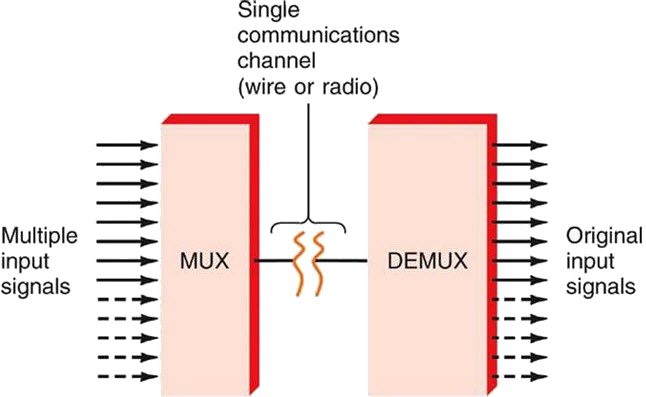
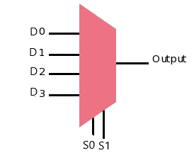
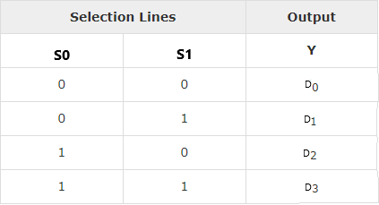
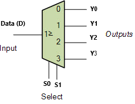
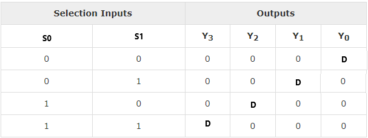

### Introduction

The function of a multiplexer is to select the input of any ‘n’ input lines and feed that to one output line. The function of a de-multiplexer is to inverse the function of the multiplexer and the shortcut forms of the multiplexer. The de-multiplexers are mux and demux. Some multiplexers perform both multiplexing and de-multiplexing operations.   

 <b>Figure-1:Block diagram of Multiplexer and De-multiplexer</b>  

      
  
### 1) Multiplexer
Multiplexer is a device that has multiple inputs and a single line output. The select lines determine which input is connected to the output, and also to increase the amount of data that can be sent over a network within certain time. It is also called a data selector. 

Multiplexers are classified into four types:

a) 2-1 multiplexer (1 select line) 
b) 4-1 multiplexer (2 select lines) 
c) 8-1 multiplexer(3 select lines) 
d) 16-1 multiplexer (4 select lines)

#### 1.1) 4x1 Multiplexer 

4x1 Multiplexer has four data inputs D0, D1, D2 & D3, two selection lines S0 & S1 and one output Y. The block diagram of 4x1 Multiplexer is shown in the following figure.One of these 4 inputs will be connected to the output based on the combination of inputs present at these two selection lines. Truth table of 4x1 Multiplexer is shown below.   

<b> Figure-2:Block diagram of 4x1 Multiplexer</b>  
   <b>Figure-3:Truth table of 4x1 Multiplexer
 </b> 
      
  
### 2) De-multiplexer
De-multiplexer is also a device with one input and multiple output lines. It is used to send a signal to one of the many devices. The main difference between a multiplexer and a de-multiplexer is that a multiplexer takes two or more signals and encodes them on a wire, whereas a de-multiplexer does reverse to what the multiplexer does. 

De-multiplexer are classified into four types: 

a)1-2 demultiplexer  (1 select line) 
b)1-4 demultiplexer  (2 select lines) 
c)1-8 demultiplexer  (3 select lines) 
d)1-16 demultiplexer (4 select lines)   

#### 2.2) 1x4 De-multiplexer  

1x4 De-Multiplexer has one input Data(D), two selection lines, S0 & S1 and four outputs Y0, Y1, Y2 & Y3. The block diagram of 1x4 De-Multiplexer is shown in the following figure.  

 <b>Figure-4:Block diagram of 1x4 De-Multiplexer</b>  
  <b>Figure-5:Truth table of 1x4 De-Multiplexer</b> 

